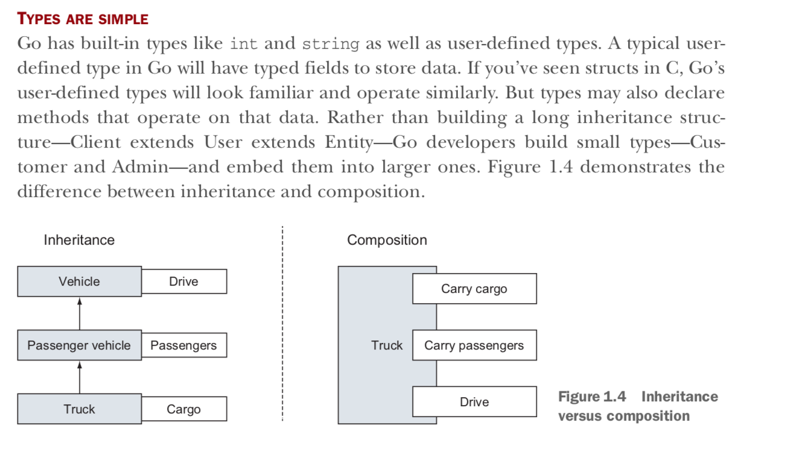
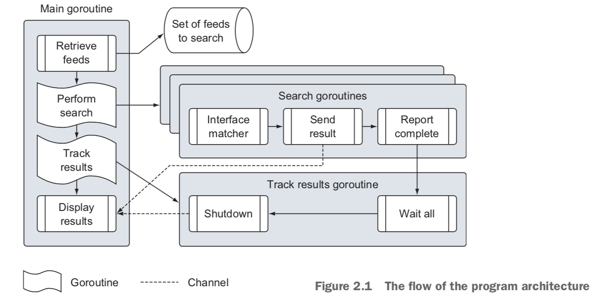

# Go Lang!

Lecture 1:

Resources:

- Main website: [https://golang.org](https://golang.org/)
- Effective GO: [https://golang.org/doc/effective_go.html](https://golang.org/doc/effective_go.html)
- Language Spec: [https://golang.org/ref/spec](https://golang.org/ref/spec)

Books:

- [http://www.golang-book.com/books/intro](http://www.golang-book.com/books/intro)

Lecture 2:

Why golang?

Makers: Ken Thompson, Rob Pike, Robert Griesemer 

- performant, multiple-cores, concurrency, compiled, network, clean syntax, powerful standard library, garbage collection, portable architecture, by google, open source
- Better server side language than node.js [TJ Holowaychuk]
- Use cases: web apps, scripts, system admin, image processing, load balancing, servers, crypto, hardware, android, IOS

Lecture 3:

- go playground: [https://play.golang.org](https://play.golang.org/)

    //#1. Hello World program
    
    //Package declarations; all like code in one package; what package do you belong to
    package main
    
    // import code written by others; standard library or 3rd party library
    import (
    	"fmt"
    )
    
    func main() {
    	fmt.Print("Raja")
    	fmt.Println("Hello world")
    }
    
    Output: 
    RajaHello world
    Shared: https://play.golang.org/p/m24LqeQiv6D

- standard library: [https://golang.org/pkg/](https://golang.org/pkg/)fmt
- public libraries and standard libraries: [https://godoc.org](https://godoc.org/)
- source files: [https://golang.org/src/](https://golang.org/pkg/)fmt

**Thread**: 

A thread is an independent set of values for the processor registers (for a single core). Since this includes the Instruction Pointer (aka Program Counter), it controls what executes in what order. It also includes the Stack Pointer, which had better point to a unique area of memory for each thread or else they will interfere with each other.

Threads are the software unit affected by control flow (function call, loop, goto), because those instructions operate on the Instruction Pointer, and that belongs to a particular thread. Threads are often scheduled according to some prioritization scheme (although it's possible to design a system with one thread per processor core, in which case every thread is always running and no scheduling is needed).

In fact the value of the Instruction Pointer and the instruction stored at that location is sufficient to determine a new value for the Instruction Pointer. For most instructions, this simply advances the IP by the size of the instruction, but control flow instructions change the IP in other, predictable ways. The sequence of values the IP takes on forms a path of execution weaving through the program code, giving rise to the name "thread".

# In detail:

The exact list of CPU registers depends on the architecture, but instruction pointer and stack pointer are pretty much universal. They define a thread insofar as when this thread (set of register values) is loaded in the processor core, the thread is running. The processor is fetching instructions demanded by the thread and updating the thread registers. When a context switch is needed, the processor saves this set of register values into memory and loads a set belonging to a different thread, typically as part of the interrupt servicing logic

# In detail:

A thread is an execution context, which is all the information a CPU needs to execute a stream of instructions.

Suppose you're reading a book, and you want to take a break right now, but you want to be able to come back and resume reading from the exact point where you stopped. One way to achieve that is by jotting down the page number, line number, and word number. So your execution context for reading a book is these 3 numbers.

If you have a roommate, and she's using the same technique, she can take the book while you're not using it, and resume reading from where she stopped. Then you can take it back, and resume it from where you were.

Threads work in the same way. A CPU is giving you the illusion that it's doing multiple computations at the same time. It does that by spending a bit of time on each computation. It can do that because it has an execution context for each computation. Just like you can share a book with your friend, many tasks can share a CPU.

On a more technical level, an execution context (therefore a thread) consists of the values of the CPU's registers.

Last: threads are different from processes. A thread is a context of execution, while a process is a bunch of resources associated with a computation. A process can have one or many threads.

Clarification: the resources associated with a process include memory pages (all the threads in a process have the same view of the memory), file descriptors (e.g., open sockets), and security credentials (e.g., the ID of the user who started the process).

Ref: [https://stackoverflow.com/questions/5201852/what-is-a-thread-really#](https://stackoverflow.com/questions/5201852/what-is-a-thread-really#)

Golang concurrency:

- Similar to threads in C or Java; Golang uses GoRoutines to break the threads further and uses logical processors per thread. These logical processors are bound to a single OS thread. Data structures called Channels are used to communicate data between the GoRoutines.

    func log(msg string){
        ... some logging code here
    }
    // Elsewhere in our code after we've discovered an error.
    go log("something dire happened")

> That keyword go is all you need to schedule the log function to run as a goroutine and for that goroutine be run concurrently with other goroutines. This means you can continue executing the rest of your application while the logging happens concur- rently

- Locking disciplines to prevent unsynchronized changes to the same variables.
- Channels do not provide data access protection between goroutines.

In Go, types are com- posed of smaller types, which is in contrast to traditional inheritance-based models.

Note: You don’t need to declare that you’re implementing an interface in Go; the compiler does the work of determining whether values of your types satisfy the interfaces you’re using.

***Duck typing:*** If it quacks it can be a duck!

You don’t even need to declare that you’re implementing an interface; you just need to write the implementation. No special declarations are required.

Ref: [https://github.com/goinaction/code/tree/master/chapter2/sample](https://github.com/goinaction/code/tree/master/chapter2/sample)

- sample - data

data.json -- Contains a list of data feeds - matchers

rss.go -- Matcher for searching rss feeds - search
    default.go -- Default matcher for searching data 

    feed.go -- Support for reading the json data file 

    match.go -- Interface support for using different matchers 

    search.go -- Main program logic for performing search
 main.go -- Programs entry point

- The function main must be declared, and it becomes the entry point for the program.
- A package defines a unit of compiled code, and each unit of code represents a package.

Blank identifiers:

- Blank identifiers are used → to allow initialization from a package to occur, even if you don’t directly use any identifiers from the package. ???

    package main
    
    # We import the matchers package and 
    # use the blank identifier before listing out the import path.
    
    # The compiler will always look for the packages you 
    # import at the locations ref- erenced by the GOROOT 
    # and GOPATH environment variables.
    
    import (
    	"log"
    	"os"
    
    	_ "github.com/goinaction/code/chapter2/sample/matchers"
    	"github.com/goinaction/code/chapter2/sample/search"
    )
    
    // init is called prior to main.
    func init() {
    	// Change the device for logging to stdout.
    	log.SetOutput(os.Stdout)
    }
    
    // main is the entry point for the program.
    func main() {
    	// Perform the search for the specified term.
    	search.Run("president")
    }

**Environmental variables:**

    GOROOT="/Users/me/go"
    GOPATH="/Users/me/spaces/go/projects"

**Identifiers:**

Identifiers are either exported or unexported from a package. An exported identifier can be directly accessed by code in other packages when the respective package is imported. These identifiers start with a capital letter. 

Unexported identifiers start with a lowercase letter and can’t be directly accessed by code in other pack- ages.

`make(map[string]Matcher)`

    // _Interfaces_ are named collections of method
    // signatures.
    
    package main
    
    import "fmt"
    import "math"
    
    // Here's a basic interface for geometric shapes.
    type geometry interface {
        area() float64
        perim() float64
    }
    
    // For our example we'll implement this interface on
    // `rect` and `circle` types.
    type rect struct {
        width, height float64
    }
    type circle struct {
        radius float64
    }
    
    // To implement an interface in Go, we just need to
    // implement all the methods in the interface. Here we
    // implement `geometry` on `rect`s.
    func (r rect) area() float64 {
        return r.width * r.height
    }
    func (r rect) perim() float64 {
        return 2*r.width + 2*r.height
    }
    
    // The implementation for `circle`s.
    func (c circle) area() float64 {
        return math.Pi * c.radius * c.radius
    }
    func (c circle) perim() float64 {
        return 2 * math.Pi * c.radius
    }
    
    // If a variable has an interface type, then we can call
    // methods that are in the named interface. Here's a
    // generic `measure` function taking advantage of this
    // to work on any `geometry`.
    func measure(g geometry) {
        fmt.Println(g)
        fmt.Println(g.area())
        fmt.Println(g.perim())
    }
    
    func main() {
        r := rect{width: 3, height: 4}
        c := circle{radius: 5}
    
        // The `circle` and `rect` struct types both
        // implement the `geometry` interface so we can use
        // instances of
        // these structs as arguments to `measure`.
        measure(r)
        measure(c)
    }

Ref: [https://play.golang.org/p/313UebA3rD](https://play.golang.org/p/313UebA3rD)

Ref: [https://gobyexample.com/interfaces](https://gobyexample.com/interfaces)

Share: [https://play.golang.org/p/9L-OL8v8JIg](https://play.golang.org/p/9L-OL8v8JIg)

    package main
    import "fmt"
    func main(){
    	t := vehicle{cargo: true, passengers: true}
    	fmt.Println(t.categorize())
    }
    type drive interface{
    	categorize() string
    }
    type vehicle struct{
    	cargo, passengers bool
    }
    func (t vehicle) categorize() string{
    	if t.cargo && t.passengers {
    		return "Yes the vehicle drive is a truck"
    	}
    	return "The vehicle is not a truck"
    }

Share: [https://play.golang.org/p/ufy-VcndbPk](https://play.golang.org/p/ufy-VcndbPk)

## Short variable declarations (:=)

Inside a function, the `:=` short assignment statement can be used in place of a `var` declaration with implicit type.

Outside a function, every statement begins with a keyword (`var`, `func`, and so on) and so the `:=` construct is not available.

    package main
    import "fmt"
    func main() {
    	var i, j int = 1, 2
    	k := 3
    	c, python, java := true, false, "no!"
    
    	fmt.Println(i, j, k, c, python, java)
    }

Editor:

Webstorm plugin: [http://plugins.jetbrains.com/plugin/5047-go-language-golang-org-support-plugin](http://plugins.jetbrains.com/plugin/5047-go-language-golang-org-support-plugin)